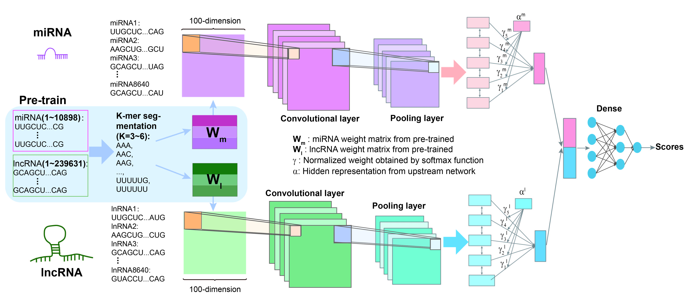

# preMLI
A pre-trained method to uncover miRNA-lnRNA patential interactions

# Introduction
This is a plant miRNA-lncRNA interaction prediction model preMLI based on pre-training and deep feature mining mechanism.\
We use the RNA data in the public data set to obtain a more accurate embedding expression weight matrix through rna2vec pre-training.\
We tested the prediction performance of the model on the benchmark dataset, and proved through experiments that the introduced pre-training mechanism and deep feature mining mechanism are effective.


# Dataset
- CABTATA_lncRNA\
	This folder contains the lncRNA sequence data obtained from the lncRNA database CANTATAdb 2.0, which is used for the embedded expression weight matrix of rna2vec training lncRNA

- miRNA\
	This folder contains the miRNA sequence data obtained from the miRNA database PMRD, which is used to train the embedded expression weight matrix of miRNA in rna2vec

- Training-validation dataset\
	The training dataset of the benchmark model in the folder
	
- Test dataseet\
	This folder contains test datasets for two benchmark models

# model
	Some models are saved in this folder.
- kmers.h5 is the model corresponding to the value of the k parameter
- lnc2021.h5 is a model that only uses lncRNA pre-training weights.
- none2021.h5 is a model that does not use pre-training weights

# File Description

- train_rna2vec.py
	rna2vec pre-training program, output as w2v file
	Parameter introduction:
	```python train_rna2vec.py 
		--inputs /home/yxy/dna2vecHZY/011-DNA2Vec/me_RNA2Vec/CABTATA_lncRNA/*fasta 
		--k-low 3        		    #kmers minimum
		--k-high 6 		            #kmers maximum
		--Min_seq 200 			    #Minimum length of words
		--Max_seq 300 			    #Maximum word length
		--vec_dim 100 			    #Output Dimensions
		--context 10 			    #Context window
		--epochs 10 			
		--gensim_iters 1 
		--out_dir ./outdir/
	```
- changeOrder.py\
	Adjust the dictionary order of the w2v file output by rna2vec and save it as an npy file
	
- sequence_processing.py\
	Process sequence data and test data input to the model
	
- train.py\
	Used for training preMLI models
- test.py\
	Evaluate the performance of models.


# Usage
```
1.python train_rna2vec.py --inputs datadir --k-low 3 --k-high 6 --Min_seq 4 --Max_seq 5 --vec_dim 100 --context 10 --epochs 10 --gensim_iters 1 --out_dir outdir
2.python changeOrder.py
3.python sequence_processing.py
4.python train.py
5.python test.py

```
